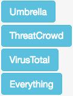

Use
===

Pre-Processing
--------------

Overview
^^^^^^^^

The pre-processing page is where indicators are displayed that GOSINT has parsed from various sources, such as Twitter and indicator feeds.

Searching/Sorting Indicators
^^^^^^^^^^^^^^^^^^^^^^^^^^^^

GOSINT allows for searching and sorting the indicators. By default, indicators are sorted with the most recent indicators listed first.

However, the indicators can be sorted by any field, including type, source, and context. Click on the column title in order to sort the indicators by these fields.

We can also search for an indicator or for indicators from a specific source or with a specific context by using the search box located on the upper right of the table.

Editing Indicators
^^^^^^^^^^^^^^^^^^

If we find that GOSINT has incorrectly parsed an indicator (for example, if GOSINT has not properly defanged an indicator), or if we would like to add additional context with an indicator, we can manually edit the indicator by clicking on any of its fields.

This opens a text box. Edit the field, and click confirm to save your changes.

In addition, tags can be inserted on a per-indicator basis. To add a tag to an indicator, select the text box under the tags column, and type the tag you would like to associate. Tags can consist of a single word or a phrase. Enter a comma or hit Enter/Return on your keyboard to finalize adding the tag to the indicator.

Remove a tag by clicking the **X** on the tag.

Querying Third Party APIs
^^^^^^^^^^^^^^^^^^^^^^^^^

The pre-processing page is a analysis workspace used to determine whether the pending indicators are malicious or not.

GOSINT has various third-party tools available for enriching raw indicators with additional context. By default, GOSINT supports Cisco Umbrella, ThreatCrowd, and VirusTotal.

If these third-party APIs are not properly configured, GOSINT will display a notice advising the user that these APIs should be configured in the Settings page.

To launch any of these APIs, click the buttons labeled **Umbrella**, **ThreatCrowd**, or **VirusTotal**. Click the **Everything** button to call all available APIs at once.

When the 3rd party enrichment window is closed, the row containing the indicator becomes **bold** and *italicized*.

Deleting Indicators
^^^^^^^^^^^^^^^^^^^

To delete an indicator that has been determined to be non-malicious, click the **orange X button** |x-button|. This removes the indicator from the pre-processing table.

Indicators that have been deleted are no longer visible on the pre-processing page again, however they are stored permanently in the backend of GOSINT to prevent their recurrence.

Moving to Post-Processing
^^^^^^^^^^^^^^^^^^^^^^^^^

Once you confirm an indicator is valid and you want to keep it, click the **green right-direction arrow button** |arrow-button|. The indicator is removed from the pre-processing table, and is added into the post-processing table.

Bulk Selecting Indicators
^^^^^^^^^^^^^^^^^^^^^^^^^

To bulk select indicators, click the **blue button with the bulleted items** |bullet-button| for an indicator. Continue clicking this button for other indicators to add to the bulk selection.

Optionally, utilize the Select All on Current Page button on the bottom right of the table to select/deselect all indicators on the current page.

Click Bulk Move to Post-Processing and Bulk Delete to perform the respective bulk options on the bottom right of the table.

Post-Processing
---------------

Overview
^^^^^^^^

This page is where indicators that have been marked as malicious in pre-processing are loaded.

Searching/Sorting/Editing Indicators
^^^^^^^^^^^^^^^^^^^^^^^^^^^^^^^^^^^^

As with the pre-processing page, we can search, sort and edit indicators.

Deleting Indicators
^^^^^^^^^^^^^^^^^^^

If an indicator was moved into post-processing by mistake, then we can remove the indicator by clicking the **orange X button** |x-button| in the appropriate row.

Transfer Station
----------------

Overview
^^^^^^^^

This page is where we can select indicators in the post-processing stage for export into various locations.

Currently, GOSINT supports export into CSV and `CRITs <https://crits.github.io/>`_. Additional export mechanisms are planned for integration into tools.

To select an indicator for export, simply click the appropriate indicator.

Exporting via CRITs
^^^^^^^^^^^^^^^^^^^

CRITs is a well-known open-source malware and threat repository. You can download CRITs from https://crits.github.io/

We can export indicators from GOSINT into CRITs by selecting CRITs as the export format.

Ensure the appropriate settings are configured in the CRITs section of the settings page prior to utilizing CRITs export.

Upon successful export via any mechanism, the indicators that were selected are removed from the post-processing stage.

Ad Hoc Operations
-----------------

GOSINT supports two Ad Hoc Operations.

- **Ad Hoc Input**: Enter any URL or a body of text to be parsed for potential indicators.

- **Ad Hoc Investigate**: Enter an indicator and conduct analysis on it, via supported APIs.

Ad Hoc Input
^^^^^^^^^^^^

Let us say that we have found an external report on a recent strain of malware on the Internet. How can we parse these indicators on an ad-hoc basis and have these indicators added into GOSINT? The ad hoc input page allows indicators to be parsed via URL, or a body of text.

**Input via URL**: Enter a valid URL that contains parseable indicators.

**Input via General Text**: For an external report in PDF or some other format, copy the text from the report into the General Text section for parsing.

**Context**: We can assign a specific context to the report, which will allow for these indicators to be assigned this context in pre-processing. For example, we can place the title of the report in the Context so we know where these indicators came from.

Click **Submit** to begin parsing the indicators. All indicators will display in the pre-processing stage with the associated context after GOSINT has parsed the indicators.

Ad Hoc Investigate
^^^^^^^^^^^^^^^^^^

If you have encountered any arbitrary indicator and would like to call the APIs built in for GOSINT, you can use the Ad Hoc Investigate page.

First, select the **Indicator Type**. You can select either "Smart" to allow GOSINT to auto-detect the type of indicator, or specify the indicator type manually (Domain, IP, etc.)

Then, enter the **Indicator** you would like to analyze. Finally, select the API you would like to call, and the results will load on the page.

Recipe Manager
--------------

Overview
^^^^^^^^

The Recipe Manager allows the user to set up tasks for automation with GOSINT. Recipes can be set up to take indicators from certain sources, apply an optional operator to analyze the indicators, and then place these indicators in a destination.

Creating a Recipe
^^^^^^^^^^^^^^^^^

To create a recipe, drag a maximum of one source and maximum of one destination to the final recipe column on the right. The **Recipe Overview** section displays the recipe to be created.

Enter a title for the recipe, and click **Create Recipe** to create the recipe. The recipe is displayed in the **Past Recipes** section below the recipe maker.

Optionally, click **Reset Recipe** to clear out a pending recipe for creation and to start over.

View and delete past recipes that have been created in the **Past Recipes** section of the Recipe Manager page.

Metrics
-------

The Metrics page displays interesting statistical information about indicators that have been processed with GOSINT.

**Indicators By Source**: This displays a pie chart of the source of all indicators processed with GOSINT.

**Indicators By Type**: This displays a pie chart of the type of all indicators processed with GOSINT.

.. |arrow-button| image:: arrow.png
  :height: 25
  :width: 25

.. |bullet-button| image:: bullet.png
  :height: 25
  :width: 25

